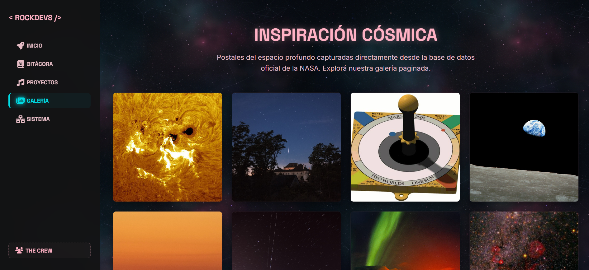
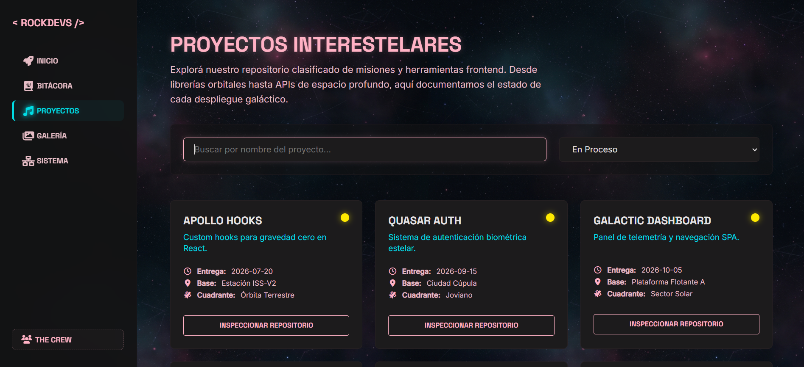
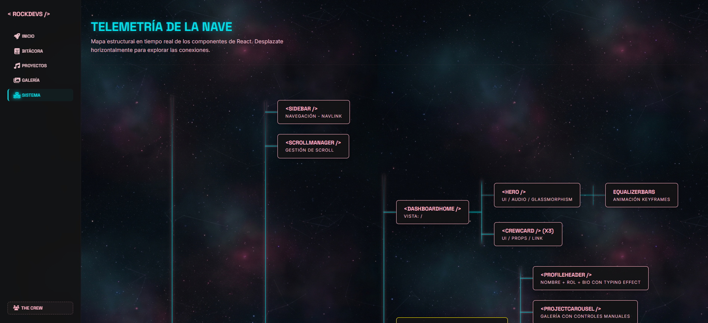
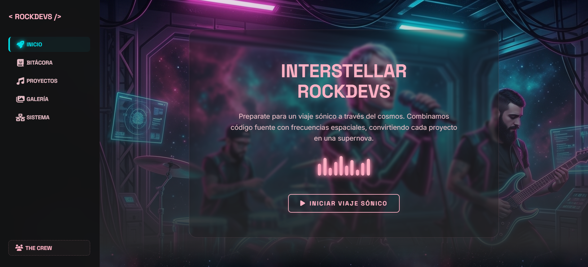
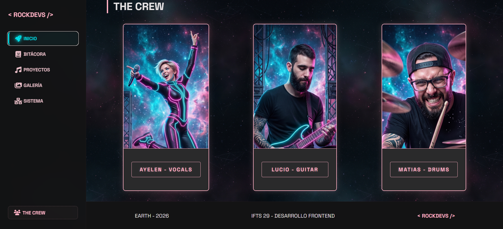
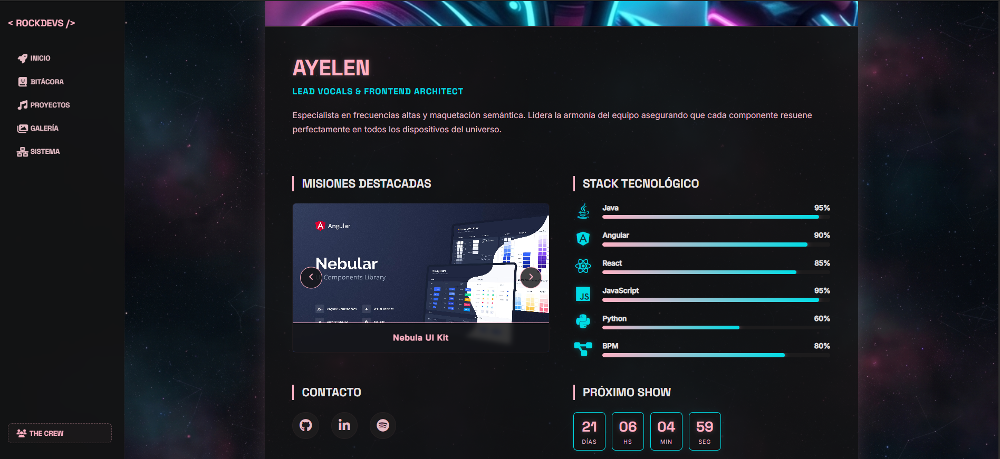
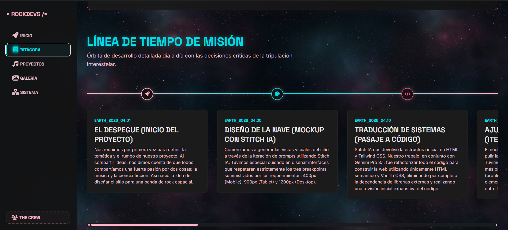
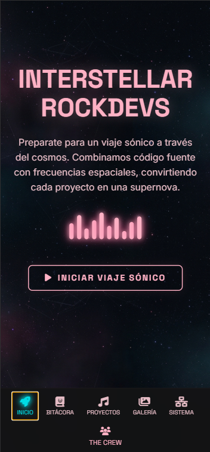

# 🚀 Interstellar RockDevs — TP2 React

[](https://react.dev/)
[](https://vite.dev/)
[](https://reactrouter.com/)
[](https://styled-components.com/)
[](https://axios-http.com/)
[](https://vercel.com/)

> 🔗 **[Ver el proyecto desplegado en Vercel](https://tp-react-grupal.vercel.app/)**

---

## 📖 Descripción

**Interstellar RockDevs** es una Single Page Application (SPA) desarrollada en React que presenta a una banda de rock espacial ficticia. Este proyecto es la evolución y migración del **TP1** (desarrollado originalmente en HTML, CSS y JavaScript vanilla) hacia una **arquitectura de componentes moderna** utilizando React.

La aplicación incluye una portada interactiva con ecualizador de audio, perfiles individuales de cada integrante con rutas dinámicas, un explorador de proyectos con filtrado en tiempo real desde un archivo JSON, una galería de imágenes consumida desde la API de la NASA con paginación y Lightbox, una bitácora cronológica del desarrollo, y una representación visual interactiva del árbol de componentes de React.

---

## 👨‍🚀 Integrantes

| Integrante | Rol | GitHub |
|---|---|---|
| **Ayelen Cristi** | Frontend Architect & Component Designer | [https://github.com/ayecristi] |
| **Lucio Gramaccioni** | UX Engineer & Animation Specialist | [https://github.com/luciograma] |
| **Matias Afonso Estanqueiro** | Lead Developer & Core Architect | [https://github.com/matias-estanqueiro] |

### Contribuciones detalladas

- **Ayelen**: Creó el proyecto inicial y la estructura base de componentes y layout con Vite + React Router. Extrajo y modularizó componentes reutilizables (Header, ProjectCard, FilterBar) desde las vistas monolíticas. Componentizó la vista ProfileView creando los subcomponentes del perfil (ProfileHeader, ProjectCarousel, SkillList, SocialLinks). Actualizó la data de crewData con imágenes de proyectos.

- **Lucio**: Implementó las animaciones de entrada con efecto stagger en las tarjetas del Dashboard (DashboardHome + CrewCard). Expandió la bitácora del proyecto con secciones de roles del equipo, flujo de trabajo y análisis de migración HTML→React. Actualizó el árbol de renderizado (systemData) con la estructura completa del proyecto.

- **Matias**: Realizó la migración core completa a React: implementó todas las vistas principales (ProfileView, ProjectsExplorer, SpaceGallery, ProjectLogbook, SystemMap, NotFound), el consumo de API NASA con Axios, React Router con rutas dinámicas, la Sidebar con navegación responsive, el Footer, el ScrollManager, el Hero con ecualizador y audio, los CrewCards, y toda la data (logbookData, projectsData.json, systemData, crewData). Gestionó las ramas del repositorio (main, develop, fase1-migracion-react), resolvió conflictos de merge y corrigió bugs de UI.

---

## 🛠️ Tecnologías Utilizadas

| Tecnología | Uso |
|---|---|
| **React 19** | Librería principal para la construcción de la interfaz con componentes |
| **Vite 8** | Bundler y servidor de desarrollo con HMR |
| **React Router 7** | Enrutamiento SPA con rutas anidadas y dinámicas |
| **styled-components 6** | CSS-in-JS con props transitorias para estilos dinámicos |
| **Axios** | Cliente HTTP para consumo de la API REST de NASA |
| **JavaScript ES6+** | Lógica de la aplicación (hooks, async/await, destructuring, arrow functions) |
| **HTML5 Semántico** | Estructura accesible y SEO-friendly |
| **CSS3** | Variables CSS, Flexbox, Grid, keyframes, media queries |
| **Google Fonts** | Tipografías: Space Grotesk + Inter |
| **Font Awesome 6** | Iconografía (CDN) |

---

## 📁 Estructura de Archivos

```
tp2-react/
├── public/
├── src/
│   ├── assets/
│   │   ├── audio/              # Pista de audio del Hero (interstellar-web.mp3)
│   │   ├── favicon/            # Favicon personalizado
│   │   └── img/                # Imágenes: perfiles, proyectos, hero, background
│   ├── components/
│   │   ├── CrewCard/           # Tarjeta de tripulante para el Dashboard
│   │   ├── FilterBar/          # Barra de filtros (input + select) para el explorador
│   │   ├── Footer/             # Pie de página global
│   │   ├── Header/             # Encabezado reutilizable de secciones (H1/H2)
│   │   ├── Hero/               # Sección hero con ecualizador animado y audio
│   │   ├── Layout/             # Layout principal (Sidebar + Outlet + Footer)
│   │   ├── Profile/            # Subcomponentes del perfil:
│   │   │   ├── ProfileHeader   #   → Nombre, rol y bio con typing effect
│   │   │   ├── ProjectCarousel #   → Galería de proyectos con controles manuales
│   │   │   ├── SkillList       #   → Barras de progreso animadas
│   │   │   └── SocialLinks     #   → Botones de redes sociales con hover
│   │   ├── ProjectCard/        # Tarjeta individual del explorador JSON
│   │   ├── ScrollManager/      # Gestión de scroll al cambiar de ruta
│   │   └── Sidebar/            # Barra de navegación lateral (desktop) / inferior (mobile)
│   ├── data/
│   │   ├── crewData.js         # Datos de los 3 integrantes (skills, projects, socials)
│   │   ├── logbookData.js      # 12 entradas cronológicas de la bitácora
│   │   ├── projectsData.json   # 20 objetos JSON para el explorador de datos
│   │   └── systemData.js       # Árbol jerárquico de componentes para el System Map
│   ├── views/
│   │   ├── DashboardHome.jsx   # Página principal: Hero + grilla animada de CrewCards
│   │   ├── ProfileView.jsx     # Perfil individual con ruta dinámica /profile/:member
│   │   ├── ProjectLogbook.jsx  # Bitácora: roles, flujo de trabajo, migración + timeline
│   │   ├── ProjectsExplorer.jsx # Explorador de datos JSON con filtros en tiempo real
│   │   ├── SpaceGallery.jsx    # Galería NASA: API + paginación + Lightbox
│   │   ├── SystemMap.jsx       # Árbol de renderizado interactivo (componente recursivo)
│   │   └── NotFound.jsx        # Página 404
│   ├── App.jsx                 # Definición de rutas con BrowserRouter
│   ├── main.jsx                # Entry point de la aplicación
│   └── index.css               # Variables CSS globales, reset y utilidades
├── docs/                       # Documentación y capturas de pantalla
├── index.html                  # Template HTML con CDN de Font Awesome y Google Fonts
├── package.json
└── vite.config.js
```

---

## 🎨 Guía de Estilos

### Paleta de Colores

| Variable CSS | Hex | Uso |
|---|---|---|
| `--bg-color` | `#131314` | Fondo principal de la aplicación |
| `--surface-low` | `#1c1b1c` | Superficies de tarjetas y contenedores |
| `--surface-high` | `#2a2a2b` | Superficies elevadas y encabezados |
| `--primary` | `#ffb1c4` | Color primario (rosa neón) — títulos, bordes, acentos |
| `--primary-container` | `#ff4a8d` | Rosa intenso — estados activos y highlights |
| `--tertiary` | `#00dce5` | Cyan neón — elementos interactivos y secundarios |
| `--on-surface` | `#e5e2e3` | Texto principal sobre superficies oscuras |
| `--on-surface-variant` | `#e5bcc5` | Texto secundario / descripciones |
| `--outline-variant` | `rgba(92, 63, 70, 0.15)` | Bordes sutiles de contenedores |

### Tipografías

| Fuente | Uso | Link |
|---|---|---|
| **Space Grotesk** | Headlines, títulos, badges, etiquetas | [Google Fonts](https://fonts.google.com/specimen/Space+Grotesk) |
| **Inter** | Cuerpo de texto, descripciones, párrafos | [Google Fonts](https://fonts.google.com/specimen/Inter) |

### Iconografía

- **Font Awesome 6** (Free) — Cargado via CDN en `index.html`
- Se utilizan íconos de las familias `fa-solid` y `fa-brands` para navegación, skills, herramientas y decoración visual.

---

## ⚙️ Funcionalidades JavaScript / React

A continuación se detallan las funcionalidades dinámicas implementadas y los conceptos de React aplicados:

### 1. React Router — Navegación SPA
Enrutamiento con `BrowserRouter`, rutas anidadas dentro de un `Layout` compartido, y ruta paramétrica `/profile/:member` para perfiles dinámicos.

### 2. styled-components — CSS-in-JS
Estilos encapsulados por componente con soporte para props transitorias (`$`) que permiten estilos dinámicos sin warnings en el DOM.

### 3. useState + useEffect — Estado y Efectos
Manejo de estado reactivo en múltiples vistas: control de audio (Hero), animación de tipeo y countdown (ProfileView), estados de API (SpaceGallery), filtros (ProjectsExplorer).

### 4. useRef — Referencias al DOM
Referencia al elemento `<audio>` en el Hero para control programático de reproducción/pausa.

### 5. useParams — Rutas Dinámicas
Extracción del parámetro `:member` de la URL para cargar el perfil correspondiente desde `crewData.js`.

### 6. Axios — Consumo de API REST
Consumo asíncrono de la API APOD de la NASA con manejo de estados de carga (loader animado tipo radar) y error.



### 7. Filtrado Reactivo Cruzado
Búsqueda por texto (`searchTerm`) combinada con filtro por estado (`statusFilter`) en el explorador de proyectos JSON, actualizando la vista en tiempo real.



### 8. Paginación Frontend
Sistema de navegación por páginas (Anterior/Siguiente) con indicador de posición actual (`Página X de Y`) y botones disabled en los extremos.

### 9. Lightbox Modal Interactivo
Visualizador de imagen expandida con:
- Navegación por flechas (botones y teclas ArrowLeft/ArrowRight)
- Cierre con tecla ESC o click en overlay
- Carga de imagen HD cuando está disponible

### 10. Carrusel de Proyectos
Galería interactiva con controles manuales (anterior/siguiente) que muestra al menos 3 trabajos por integrante en la vista de perfil.

### 11. Barras de Progreso Animadas
Componentes visuales animados que reflejan el stack técnico de cada integrante con transición CSS `cubic-bezier` al entrar en la vista.

### 12. Typing Effect
Animación de escritura progresiva de la biografía en los perfiles, implementada con `setInterval` y `substring`.

### 13. Countdown Timer
Temporizador regresivo en tiempo real que actualiza días, horas, minutos y segundos mediante `setInterval`.

### 14. Componente Recursivo TreeNode
Renderizado recursivo del árbol de componentes de la aplicación en la vista SystemMap, mostrando la jerarquía completa.



### 15. Ecualizador Animado
Barras visuales con `keyframes` de styled-components que se sincronizan con el estado de reproducción del audio.

### Capturas de Pantalla











---

## 🔗 Enlace al Proyecto Desplegado

> **[COMPLETAR_LINK_VERCEL](COMPLETAR_LINK_VERCEL)**

---

## 📈 Evolución del Proyecto

### De TP1 (HTML/CSS/JS) a TP2 (React SPA)

Este proyecto representa una evolución significativa desde la arquitectura estática del TP1 hacia una aplicación moderna basada en componentes:

| Aspecto | TP1 (Antes) | TP2 (Después) |
|---|---|---|
| **Estructura** | Archivos HTML independientes por página | Componente raíz `<App />` con React Router |
| **Estilos** | Un único CSS global monolítico | styled-components encapsulados por componente |
| **Navegación** | Recarga completa entre páginas | SPA con navegación instantánea (NavLink) |
| **Interactividad** | Manipulación directa del DOM | Estado reactivo con hooks (useState/useEffect) |
| **Datos** | Embebidos en HTML/JS | Centralizados en archivos dedicados (JSON/JS) |
| **Layout** | Repetido en cada archivo HTML | Layout compartido con Sidebar + Outlet + Footer |
| **Perfiles** | Un HTML por integrante | Una sola vista paramétrica `/profile/:member` |

### Ventajas clave de la migración

1. **Cero duplicación**: Un solo Layout compartido elimina código repetido entre páginas
2. **Navegación instantánea**: Transiciones SPA en milisegundos sin recargas
3. **Componentes reutilizables**: Un `CrewCard` sirve para todos los integrantes
4. **Mantenimiento simplificado**: Cambiar un componente se refleja en toda la app
5. **Estilos encapsulados**: styled-components evita colisiones de CSS
6. **Estado predecible**: Hooks de React vs. manipulación manual del DOM

---

## 🤖 Uso de Inteligencia Artificial

### Herramientas Utilizadas

| Herramienta | Versión/Modelo | Uso Principal |
|---|---|---|
| **Stitch IA** | — | Generación de mockups visuales iniciales |
| **Gemini** | Pro 3.1 | Refactorización de código y debugging |
| **GitHub Copilot** | — | Asistencia en escritura de código |

### Uso en Contenido y Código

- **Mockups (TP1)**: Stitch IA generó los diseños visuales iniciales en HTML y Tailwind CSS. El equipo refactorizó manualmente todo el código a HTML semántico y CSS vanilla, eliminando la dependencia de librerías externas.
- **Refactorización (TP1→TP2)**: Gemini Pro 3.1 asistió en la migración de la estructura estática a componentes React y en el debugging de layouts responsive complejos (especialmente la vista de perfiles entre breakpoints).
- **Código (TP2)**: GitHub Copilot asistió en la escritura de componentes y styled-components durante el desarrollo en React.

### Imágenes Generadas con IA

- **Avatares de integrantes**: Las imágenes de perfil de los tres tripulantes fueron generadas con IA, buscando una estética de rock espacial coherente con la temática del proyecto.
- **Background espacial**: La imagen de fondo de la aplicación fue generada con IA para crear la atmósfera cósmica del sitio.

### Nota sobre Autoría

El equipo mantuvo la autoría integral del proyecto en todo momento. La IA fue utilizada como **herramienta de asistencia** para acelerar procesos específicos (mockups iniciales, debugging, sugerencias de código), pero todas las **decisiones de arquitectura, diseño visual, lógica de negocio y estructura de componentes** fueron tomadas, evaluadas y ejecutadas por el equipo.

---

<p align="center">
  <strong>&lt; ROCKDEVS /&gt;</strong><br/>
  <em>Interstellar RockDevs — TP2 React — 2026</em>
</p>
